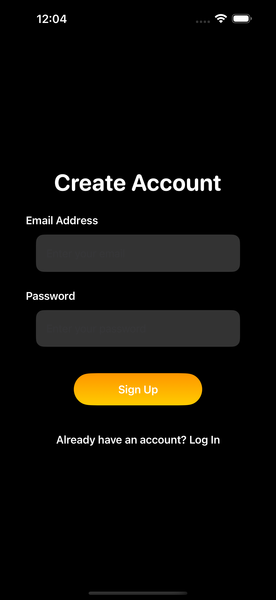
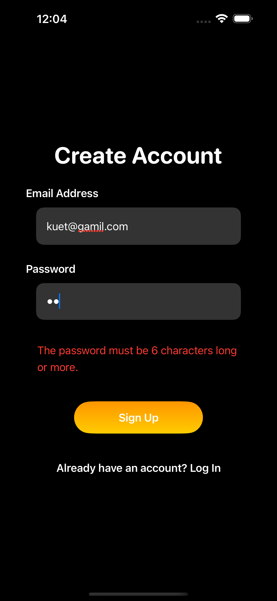
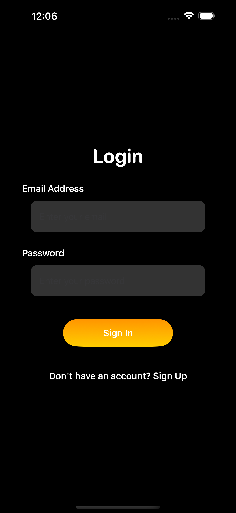
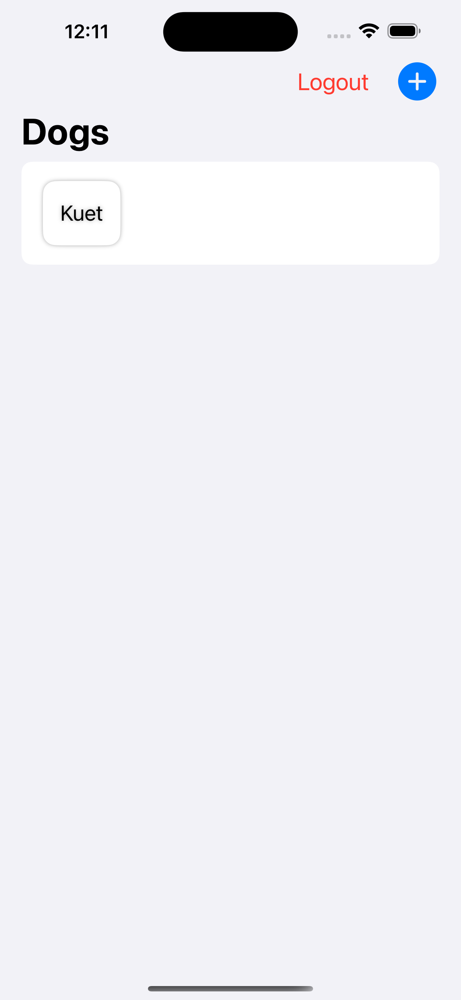

# Assignment Submitted by Dipto Saha
# Roll : 2007119
# Firebase Authentication and Firestore Integration

A simple iOS assignment demonstrating user authentication using Firebase and Firestore. This project allows users to sign up, log in, and manage their data securely using Firebase services which is
built in swift.

---

## Features

- **User Signup**: Register new users with email and password.
- **User Login**: Authenticate existing users.
- **Firestore Integration**: Store and retrieve user data in a Firestore database.

---

## Preview

### Screenshot 1: Signup Page

  

A "Create Account" screen with fields for email and password and a "Sign Up" button in a dark theme.

### Screenshot 2:Giving Invalid Input

  

A "Create Account" screen showing an invalid password error ("The password must be 6 characters long or more") after entering a short password.

### Screenshot 3: Login Page

  

This  image shows a sleek login screen with a black background and input fields for email and password.

### Screenshot 3: Firestore Integration Example

  

 This image shows the firestore integration .

 ## Contact

For any questions or feedback, reach out to:

- **Name**: Dipto Saha  
- **Email**: diptosaha.ndc50@gmail.com  
- **GitHub**: [Dipto's GitHub](https://github.com/DsDipto7)

---
